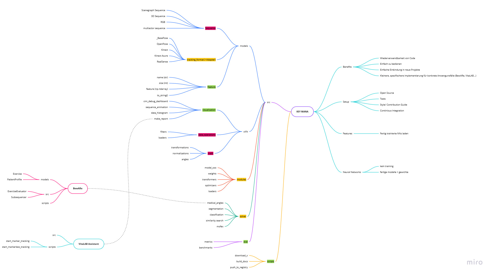

# MANA

MANA - Motion ANAlysis project is a software to analyze motions.

Whalecome may frend. I've heared ju want tu konribut? Follou sies ruls, plis:

## Contributing

### Install dependencies

1. (opt) Setup a virtual environment solution. (e.g. [Anaconda](https://www.anaconda.com/products/individual))
2. Open terminal in project root
3. Install required dependencies from [requirements.txt](requirements.txt)
   1. `pip install -r requirements.txt`

### How to test code

1. Open terminal and navigate to project root
2. Type `pytest` to start tests

#### Test Guidelines

**General**
1. Every module **needs** a test!
2. Test driven development
   1. Try to write your test first, then implement your classes & methods
3. 80/20 rule
   1. Tests should cover 80% of functionality in 20% of development time

**PyTest**
1. Make use of *fixtures* to avoid initialization boilerplate
   1. You can also specify a *scope* to the fixture method (e.g. function, class, module, session)

```python
import pytest
@pytest.fixture(scope='function')
def class_xy():
   class_instance = ClassXY(value)
   return class_instance

def test_class_init(class_xy):
   assert class_instance.value == expected

def test_class_method(class_xy):
   assert class_instance.method == expected
```

2. Parameterize your tests methods to check multiple values

```python
import pytest
@pytest.mark.parametrize('key1, key2', [('value11', 12), ('value21', 22)])
def test_method(key1, key2):
   assert your_method(key1, key2) == expected
```

3. Mark your test methods to filter them
   1. You can mark fast or *slow* tests, or add extra conditions like *skip* or *skipif*

```python
import pytest
@pytest.mark.skipif(sys.version_info < (3, 6), reason="requires python3.6 or higher")
def test_method():
    assert True
```

#### References

* [Intro to PyTest](https://medium.com/testcult/intro-to-test-framework-pytest-5b1ce4d011ae)
* [Testing with PyTest](https://semaphoreci.com/community/tutorials/testing-python-applications-with-pytest)
* [Official PyTest Docs](https://docs.pytest.org/en/latest/contents.html)


## Project Mind map (concept & ideas)

